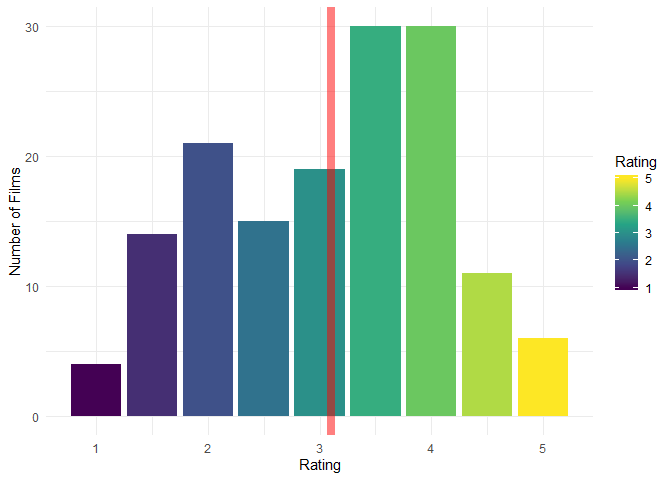
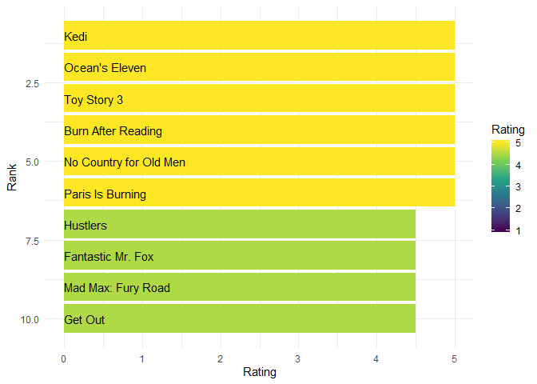

2019 Year in Review
================
Forrest Diamond
January 5, 2019

## Prep the workspace

``` r
library("tidyverse")
```

## Movies Over Time

Let’s have a quick look at my movie watching counts.

``` r
diary <- read.csv(file.path(here::here(), "data", "diary.csv"))

diary %>% 
  mutate(year = lubridate::year(Watched.Date),
         date = lubridate::as_date(Watched.Date)) %>% 
  filter(year == 2019) %>%
  count(date) %>%
  arrange(date) %>%
  mutate(running_total = cumsum(n)) %>%
  ggplot() +
  geom_point(aes(x = date, y = running_total)) +
  labs(x = "Date Watched",
       y = "Cumulative Total",
       title = "That's a lot of movies") +
  theme_minimal() +
  scale_x_date()
```

<!-- -->

## Ratings

Let’s see if I’m using the whole scale for my ratings.

``` r
ratings <- read.csv(file.path(here::here(), "data", "ratings.csv"))

ratings %>% 
  mutate(year = lubridate::year(Date)) %>% 
  filter(year == 2019) %>%
  count(Rating) %>%
  mutate(mean = weighted.mean(Rating, w = n)) %>%
  ggplot() +
  geom_bar(aes(x = Rating, y = n), stat = "identity") + 
  geom_vline(aes(xintercept = mean), color = "red", alpha = 0.5, size = 3) +
  theme_minimal() +
  labs(x = "Rating",
       y = "Number of Films")
```

<!-- -->

I might have the spread down, but it looks like I’m not labelling enough
movies in the middle. What if I simplified this by only using five
buckets?

``` r
ratings <- read.csv(file.path(here::here(), "data", "ratings.csv"))

ratings %>% 
  mutate(year = lubridate::year(Date)) %>% 
  filter(year == 2019) %>%
  count(Rating) %>%
  mutate(is_split = ifelse(Rating - floor(Rating) > 0.1, T, F)) %>%
  left_join({.} %>%
              filter(is_split) %>%
              mutate(Rating = floor(Rating)) %>%
              mutate(floor_n = n / 2) %>%
              select(Rating, floor_n),
            by = "Rating") %>%
  left_join({.} %>%
              filter(is_split) %>%
              mutate(Rating = ceiling(Rating)) %>%
              mutate(ceiling_n = n / 2) %>%
              select(Rating, ceiling_n),
            by = "Rating") %>%
  mutate_if(is.numeric, ~replace(., is.na(.), 0)) %>%
  mutate(total_n = n + floor_n + ceiling_n) %>%
  filter(!is_split) %>%
  select(Rating, total_n) %>%
  ggplot() +
  geom_bar(aes(x = Rating, y = total_n), stat = "identity") + 
  theme_minimal() +
  labs(x = "Rating",
       y = "Number of Films")
```

<!-- -->

Yup, not enough threes, too many twos and fours.

## Top Movies

Now let’s see the best movies I saw this year, and the best movies from
this year.

``` r
ratings <- read.csv(file.path(here::here(), "data", "ratings.csv"))

ratings %>% 
  mutate(year = lubridate::year(Date)) %>% 
  filter(year == 2019) %>%
  arrange(-Rating) %>%
  head(10) %>%
  mutate(place = row_number()) %>%
  ggplot() +
  geom_bar(aes(x = place, y = Rating, fill = Rating), stat = "identity") +
  geom_text(aes(x = place, y = 0, label = Name), hjust = 0, color = "white") +
  theme_minimal() +
  coord_flip() +
  scale_x_reverse()
```

<!-- -->

``` r
ratings <- read.csv(file.path(here::here(), "data", "ratings.csv"))

ratings %>% 
  mutate(year = lubridate::year(Date)) %>% 
  filter(year == 2019, Year == 2019) %>%
  arrange(-Rating) %>%
  head(10) %>%
  mutate(place = row_number()) %>%
  ggplot() +
  geom_bar(aes(x = place, y = Rating, fill = Rating), stat = "identity") +
  geom_text(aes(x = place, y = 0, label = Name), hjust = 0, color = "white") +
  theme_minimal() +
  coord_flip() +
  scale_x_reverse()
```

<!-- -->
But why doesn’t the `ratings.csv` file go back as far as the `diary.csv`
file?

```` 
                  ```r
                                      ratings %>% 
                  count(Date) %>% 
                  ggplot() +
                  geom_bar(aes(x = lubridate::as_date(Date), y = n), stat = "identity") +
                  labs(title = "HMMMM",
                       x = "Date Watched",
                       y = "Number of Films Watched") +
                  scale_x_date(labels = scales::date_format("%B, %Y")) +
                  theme_minimal()
                  ```
                  
                  <!-- -->
                
                HMMM Indeed...
````
