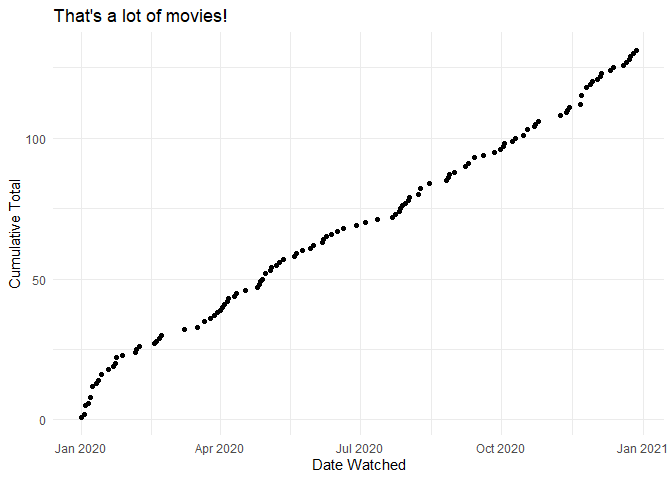
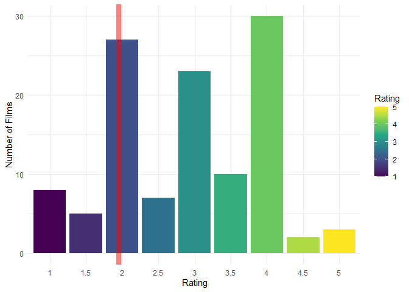
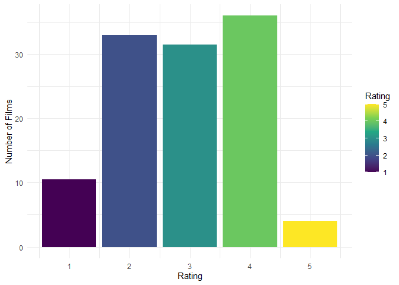
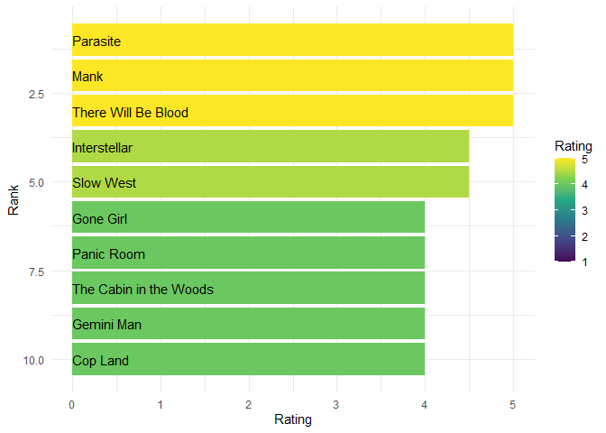
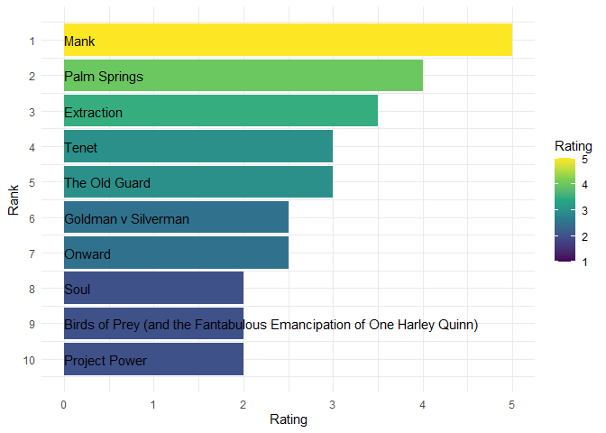

2020 Year in Review
================
Forrest Diamond

Prep the workspace
------------------

``` r
library("tidyverse")
```

Movies Over Time
----------------

Let’s have a quick look at my movie watching counts.

``` r
diary <- read.csv(file.path(here::here(), "data", "diary.csv"))

diary %>% 
  mutate(year = lubridate::year(Watched.Date),
         date = lubridate::as_date(Watched.Date)) %>% 
  filter(year == 2020) %>%
  count(date) %>%
  arrange(date) %>%
  mutate(running_total = cumsum(n)) %>%
  ggplot() +
  geom_point(aes(x = date, y = running_total)) +
  labs(x = "Date Watched",
       y = "Cumulative Total",
       title = "That's a lot of movies!") +
  theme_minimal() +
  scale_x_date()
```

<!-- -->

Ratings
-------

Let’s see if I’m using the whole scale for my ratings.

``` r
ratings <- read.csv(file.path(here::here(), "data", "ratings.csv"))

ratings %>% 
  mutate(year = lubridate::year(Date)) %>% 
  filter(year == 2020) %>%
  count(Rating) %>%
  mutate(mean = weighted.mean(Rating, w = n)) %>%
  ggplot() +
  geom_bar(aes(x = factor(Rating), y = n, fill = Rating), stat = "identity") + 
  geom_vline(aes(xintercept = mean), color = "red", alpha = 0.5, size = 3) +
  theme_minimal() +
  labs(x = "Rating",
       y = "Number of Films") +
  scale_fill_viridis_c(limits = c(1, 5))
```

<!-- -->

I might have the spread down, but it looks like I’m not labelling enough
movies in the middle. What if I simplified this by only using five
buckets?

``` r
ratings <- read.csv(file.path(here::here(), "data", "ratings.csv"))

ratings %>% 
  mutate(year = lubridate::year(Date)) %>% 
  filter(year == 2020) %>%
  count(Rating) %>%
  mutate(is_split = ifelse(Rating - floor(Rating) > 0.1, T, F)) %>%
  left_join({.} %>%
              filter(is_split) %>%
              mutate(Rating = floor(Rating)) %>%
              mutate(floor_n = n / 2) %>%
              select(Rating, floor_n),
            by = "Rating") %>%
  left_join({.} %>%
              filter(is_split) %>%
              mutate(Rating = ceiling(Rating)) %>%
              mutate(ceiling_n = n / 2) %>%
              select(Rating, ceiling_n),
            by = "Rating") %>%
  mutate_if(is.numeric, ~replace(., is.na(.), 0)) %>%
  mutate(total_n = n + floor_n + ceiling_n) %>%
  filter(!is_split) %>%
  select(Rating, total_n) %>%
  ggplot() +
  geom_bar(aes(x = Rating, y = total_n, fill = Rating), stat = "identity") + 
  theme_minimal() +
  labs(x = "Rating",
       y = "Number of Films") +
  scale_fill_viridis_c(limits = c(1, 5))
```

<!-- -->

Yup, not enough threes, too many twos and fours.

Top Movies
----------

Now let’s see the best movies I saw this year, and the best movies from
this year.

``` r
ratings <- read.csv(file.path(here::here(), "data", "ratings.csv"), fileEncoding = "UTF-8")

ratings %>% 
  mutate(year_watched = lubridate::year(Date)) %>% 
  filter(year_watched == 2020) %>%
  mutate(Rank = rank(-Rating, ties.method = "random")) %>% 
  filter(Rank <= 10) %>% 
  ggplot() +
  geom_bar(aes(x = Rank, y = Rating, fill = Rating), stat = "identity") +
  geom_text(aes(x = Rank, y = 0, label = Name), hjust = 0) +
  theme_minimal() +
  coord_flip() +
  scale_x_reverse() +
  scale_fill_viridis_c(limits = c(1, 5))
```

<!-- -->

Wow, not a lot of movies made in 2020 on that list. What if we only look
at those?

``` r
ratings <- read.csv(file.path(here::here(), "data", "ratings.csv"), fileEncoding = "UTF-8")

ratings %>% 
  filter(Year == 2020) %>%
  mutate(Rank = rank(-Rating, ties.method = "random")) %>% 
  filter(Rank <= 10) %>% 
  ggplot(aes(x = Rank)) +
  geom_bar(aes(y = Rating, fill = Rating), stat = "identity") +
  geom_text(aes(y = 0, label = Name), hjust = 0) +
  theme_minimal() +
  coord_flip() +
  scale_x_reverse(breaks = 1:10) +
  scale_fill_viridis_c(limits = c(1, 5)) 
```

<!-- -->

What an awful year of movies :(.

Reviews
-------

I don’t think I did a great job recording reviews- how’d I do?

``` r
reviews <- read_csv(file.path(here::here(), "data", "reviews.csv"))
```

    ## Parsed with column specification:
    ## cols(
    ##   Date = col_date(format = ""),
    ##   Name = col_character(),
    ##   Year = col_double(),
    ##   `Letterboxd URI` = col_character(),
    ##   Rating = col_double(),
    ##   Rewatch = col_character(),
    ##   Review = col_character(),
    ##   Tags = col_character(),
    ##   `Watched Date` = col_date(format = "")
    ## )

``` r
reviews %>% 
  filter(lubridate::year(`Watched Date`) == 2020) %>%
  nrow()
```

    ## [1] 57

Not bad…

2020 Goals
----------

-   [ ] Watch 150 Movies
-   [ ] Write 75 Reviews
-   [ ] Get closer to a normal distribution in my ratings

Failed at all three! Here’s to next year…
